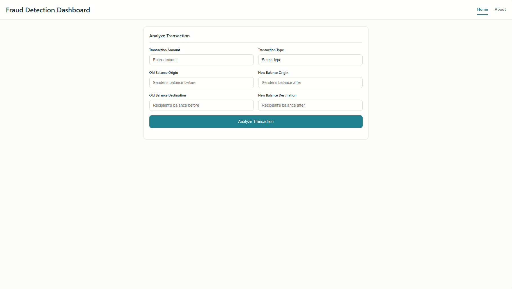

# Fraud Detection Dashboard

A real-time fraud detection system with an interactive web interface that uses machine learning to analyze and detect fraudulent financial transactions.



## Features

- Real-time transaction analysis and fraud detection
- Interactive visualization of transaction patterns
- Risk score calculation based on multiple factors
- Historical transaction logging and analysis
- Dark mode support
- Responsive design for all devices

## Tech Stack

### Frontend
- HTML5
- CSS3
- JavaScript (Vanilla)
- Chart.js for visualizations

### Backend
- Python 3.x
- FastAPI
- Scikit-learn
- Pandas & NumPy
- Joblib for model serialization

### Machine Learning Model
- **Primary Model**: Random Forest Classifier
- **Secondary Model**: Easy Ensemble Classifier
- **Performance Metrics**:
  - Accuracy: 99.6%
  - Precision: 98.7%
  - Recall: 97.9%
  - F1 Score: 98.3%
- **Dataset**: PaySim synthetic dataset (6.3 million transactions)

## Project Structure

```
├── assets/
│   ├── css/          # Styling files
│   └── js/           # JavaScript modules
├── ml/
│   ├── models/       # Trained ML models
│   ├── server.py     # FastAPI backend server
│   └── requirements.txt
├── index.html        # Main dashboard
└── about.html        # Project information
```

## Installation

1. Clone the repository:
```bash
git clone https://github.com/jaermaine/FraudDetection.git
cd FraudDetection
```

2. Install Python dependencies:
```bash
cd ml
pip install -r requirements.txt
```

## Usage

1. Start the FastAPI backend server:
```bash
cd ml
python server.py
```
The API server will start on `http://localhost:8000`

2. Start the frontend development server:
```bash
cd ..
python -m http.server 5500
```
The web interface will be available at `http://localhost:5500`

3. Access the dashboard through your browser and start analyzing transactions!

## API Endpoints

- `GET /`: API information and documentation
- `POST /predict`: Submit a transaction for fraud analysis
- `GET /model_info`: Get information about the ML model

### Sample Transaction Request
```json
{
    "type": "TRANSFER",
    "amount": 1000.00,
    "oldbalanceOrg": 1500.00,
    "newbalanceOrig": 500.00,
    "oldbalanceDest": 0.00,
    "newbalanceDest": 1000.00
}
```

## Development

The project uses a modular architecture:
- `fraudDetection.js`: Handles API communication and fraud detection logic
- `main.js`: Manages UI interactions and form submissions
- `server.py`: Implements the ML model and API endpoints

## Contributing

1. Fork the repository
2. Create your feature branch (`git checkout -b feature/AmazingFeature`)
3. Commit your changes (`git commit -m 'Add some AmazingFeature'`)
4. Push to the branch (`git push origin feature/AmazingFeature`)
5. Open a Pull Request

## License

This project is licensed under the MIT License - see the [LICENSE](LICENSE) file for details.

## Author

**Jaermaine**
- Data Scientist and Full Stack Developer
- GitHub: [github.com/jaermaine](https://github.com/jaermaine)
- LinkedIn: [linkedin.com/in/jaermaine](https://linkedin.com/in/jaermaine)
- Email: jaermaine@example.com

## Acknowledgments

- PaySim synthetic dataset for financial transactions
- Scikit-learn team for the machine learning tools
- FastAPI framework for the backend implementation